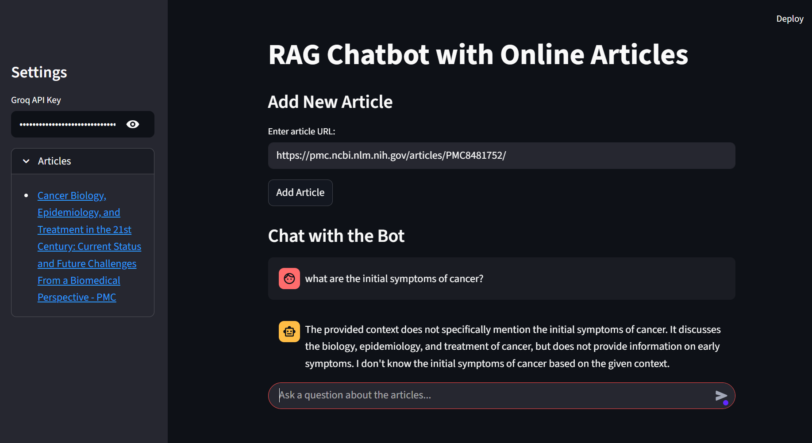

# 🧠 RAG Chatbot with Online Articles  

A Retrieval-Augmented Generation (**RAG**) chatbot built with **Streamlit** and **LangChain** that allows you to fetch articles from the web, store them in a vector database (**ChromaDB**), and ask questions about them in natural language.  

## 🚀 Features  
- Add articles by pasting their URL.  
- Automatically fetches and processes article content.  
- Stores embeddings locally in `chroma_db/` using **ChromaDB**.  
- Ask natural language questions about added articles.  
- Uses **Groq API** for fast and efficient language model inference.  

## 🛠️ Tech Stack  
- **Frontend/UI**: Streamlit  
- **LLM Orchestration**: LangChain  
- **Vector Database**: ChromaDB  
- **Web Scraping**: BeautifulSoup4, Requests  
- **Models**: Groq LLMs, HuggingFace Embeddings  

## 📂 Project Structure  
P4 (RAG-bot)/
│── app.py # Main Streamlit app
│── ragbot.py # RAG logic and helper functions
│── requirements.txt # Project dependencies
│── .env # API keys (Groq, etc.)
│── chroma_db/ # Auto-generated vector database
│── RAG-bot UI.png # Screenshot of the UI
│── code.ipynb # Jupyter notebook (experiments)

## ⚙️ Setup & Installation  

1. **Clone the repository**
    git clone https://github.com/she-readzs/RAG-bot.git
    cd RAG-bot

2. Create and activate virtual environment
   python -m venv env
   env\Scripts\activate     # On Windows
   # source env/bin/activate  # On Mac/Linux

3. Install dependencies
   pip install -r requirements.txt

4. Add your API keys
   Create a .env file in the project root:

   GROQ_API_KEY=your_api_key_here

5. Run the app
   streamlit run app.py

## 📝 Usage

1. Enter an article URL in the input box.
2. Click Add Article → the article is scraped, chunked, and stored.
3. Ask your questions in the chatbot section.
4. The bot retrieves relevant chunks + generates contextual answers.

# 📸 Project UI

Here’s a preview of my application:

⚠️ Notes

The chroma_db/ folder is auto-generated.

-> If deleted, your stored articles will be lost.
-> You may want to add it to .gitignore.

   

